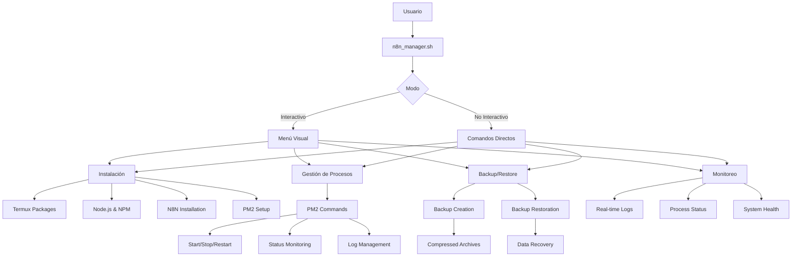

<div align="center">

# � N8N Manager para Termux Android


**Gestor unificado y profesional para N8N en dispositivos Android con Termux**

[](https://www.gnu.org/software/bash/)
[](https://termux.com/)
[](https://n8n.io/)
[](https://pm2.keymetrics.io/)
[](LICENSE)

</div>

---

## � Tabla de Contenidos

- [✨ Características](#-características)
- [�️ Capturas de Pantalla](#️-capturas-de-pantalla)
- [� Instalación Rápida](#-instalación-rápida)
- [� Uso](#-uso)
- [� Requisitos del Sistema](#-requisitos-del-sistema)
- [� Funcionalidades Detalladas](#-funcionalidades-detalladas)
- [� Arquitectura](#-arquitectura)
- [� Contribuir](#-contribuir)
- [� Licencia](#-licencia)

---

## ✨ Características

<div align="center">

| � **Gestión Completa** | � **Interfaz Visual** | ⚡ **Alto Rendimiento** |
|:---:|:---:|:---:|
| Instalación, inicio, parada, backup y restauración | Menú interactivo con colores y emojis | Optimizado para dispositivos Android |
| **�️ Seguridad** | **� Multiplataforma** | **� Fácil Uso** |
| Validaciones de errores y dependencias | Compatible con Termux en Android | Modo interactivo y no interactivo |

</div>

### � **Características Principales**

- � **Menú interactivo** con navegación intuitiva
- � **Interfaz colorida** con emojis y formato visual
- ⚙️ **Modo no interactivo** para automatización
- � **Comando directo `n8n`** disponible globalmente después de la instalación
- � **Gestión completa** de procesos con PM2
- � **Sistema de backup** automático con timestamps
- �️ **Validaciones robustas** de errores y dependencias
- � **Monitoreo en tiempo real** de logs y estado
- � **Instalación automática** de dependencias

---

## �️ Capturas de Pantalla

### � Menú Principal
```
========================================
    GESTOR DE N8N PARA TERMUX ANDROID
========================================

1) � Instalar n8n (primera vez)
2) ▶️  Iniciar n8n con PM2
3) � Crear backup de n8n
4) � Restaurar backup de n8n
5) � Ver estado de PM2
6) ⏹️  Detener n8n
7) � Reiniciar n8n
8) � Ver logs de n8n
9) � Salir

Selecciona una opción (1-9):
```

### � Estado del Sistema
```
==> Estado de PM2:
┌─────┬────────┬─────────────┬─────────┬─────────┬──────────┬────────┬──────┬───────────┬──────────┬──────────┬──────────┬──────────┐
│ id  │ name   │ namespace   │ version │ mode    │ pid      │ uptime │ ↺    │ status    │ cpu      │ mem      │ user     │ watching │
├─────┼────────┼─────────────┼─────────┼─────────┼──────────┼────────┼──────┼───────────┼──────────┼──────────┼──────────┼──────────┤
│ 0   │ n8n    │ default     │ 1.0.0   │ fork    │ 12345    │ 2m     │ 0    │ online    │ 0%       │ 45.2mb   │ root     │ disabled │
└─────┴────────┴─────────────┴─────────┴─────────┴──────────┴────────┴──────┴───────────┴──────────┴──────────┴──────────┴──────────┘
```

---

## � Instalación Rápida

### � **Paso 1: Clonar el Repositorio**
```bash
git clone https://github.com/tu-usuario/n8n-termux-android-ia.git
cd n8n-termux-android-ia
```

### � **Paso 2: Ejecutar el Gestor**
```bash
./scripts/n8n_manager.sh
```

### ⚡ **Instalación en Una Línea**
```bash
curl -sSL https://raw.githubusercontent.com/tu-usuario/n8n-termux-android-ia/main/scripts/n8n_manager.sh | bash
```

---

## � Uso

### � **Modo Interactivo (Recomendado)**
```bash
./scripts/n8n_manager.sh
```
*Navega por el menú visual con las opciones numeradas*

### ⚙️ **Modo No Interactivo**
```bash
# � Instalación completa
./scripts/n8n_manager.sh install

# ▶️  Iniciar n8n
./scripts/n8n_manager.sh start

# � Crear backup
./scripts/n8n_manager.sh backup

# � Restaurar backup
./scripts/n8n_manager.sh restore /ruta/al/backup.tar.gz

# � Ver estado
./scripts/n8n_manager.sh status

# ⏹️  Detener n8n
./scripts/n8n_manager.sh stop

# � Reiniciar n8n
./scripts/n8n_manager.sh restart

# � Ver logs en tiempo real
./scripts/n8n_manager.sh logs
```

### � **Comando Directo n8n (Después de la Instalación)**
```bash
# Después de la instalación, puedes usar directamente:
n8n start     # Iniciar n8n
n8n stop      # Detener n8n
n8n restart   # Reiniciar n8n
n8n status    # Ver estado
n8n logs      # Ver logs
n8n open      # Abrir en navegador
n8n           # Mostrar ayuda
```

---

## � Requisitos del Sistema

<div align="center">

| Componente | Versión Mínima | Recomendada |
|:----------|:--------------:|:-----------:|
| **Android** | 7.0+ | 10.0+ |
| **Termux** | 0.118+ | Última |
| **RAM** | 2GB | 4GB+ |
| **Almacenamiento** | 1GB libre | 5GB+ |
| **Conexión** | WiFi/4G | WiFi estable |

</div>

### � **Requisitos Detallados**

- � **Termux** instalado desde [GitHub Releases](https://github.com/termux/termux-app/releases) (NO desde Google Play)
- � **Conexión a internet** para la instalación inicial
- � **Almacenamiento libre** mínimo 1GB
- � **Batería** suficiente para procesos de larga duración

---

## � Funcionalidades Detalladas

### � **1. Instalación Automática**
- ✅ Actualización de paquetes de Termux
- ✅ Instalación de dependencias de compilación
- ✅ Configuración automática de NDK para node-gyp
- ✅ Instalación de N8N con SQLite embebido
- ✅ Configuración de PM2 como gestor de procesos
- ✅ Creación de directorios necesarios

### � **2. Gestión de Procesos**
- ▶️ **Inicio inteligente** con validaciones
- ⏹️ **Parada segura** con guardado de estado
- � **Reinicio automático** con recuperación
- � **Monitoreo en tiempo real** del estado
- � **Visualización de logs** con scroll automático

### � **3. Sistema de Backup**
- � **Timestamps automáticos** en nombres de archivo
- � **Compresión optimizada** con tar.gz
- � **Validación de integridad** de archivos
- � **Organización automática** en directorio backups/
- � **Restauración segura** con verificación de permisos

### � **4. Interfaz de Usuario**
- � **Colores y emojis** para mejor experiencia
- � **Diseño responsive** para pantallas pequeñas
- ⚡ **Navegación rápida** con teclas de acceso
- � **Mensajes informativos** y de error claros
- � **Indicadores visuales** de progreso

### � **5. Comando Directo n8n**
- ⚡ **Acceso global** al comando `n8n` desde cualquier directorio
- � **Comandos intuitivos** con subcomandos fáciles de recordar
- � **Gestión completa** sin necesidad del menú interactivo
- � **Integración perfecta** con Termux y PM2
- � **Sistema de ayuda** integrado con `n8n` sin argumentos

---

## � Arquitectura



---

## � Contribuir

¡Las contribuciones son bienvenidas! �

### � **Cómo Contribuir**

1. � **Fork** el repositorio
2. � **Crea** una rama para tu feature (`git checkout -b feature/AmazingFeature`)
3. � **Commit** tus cambios (`git commit -m 'Add some AmazingFeature'`)
4. � **Push** a la rama (`git push origin feature/AmazingFeature`)
5. � **Abre** un Pull Request

### � **Áreas de Contribución**

- � **Reportar bugs** y problemas
- ✨ **Nuevas funcionalidades** y mejoras
- � **Documentación** y ejemplos
- � **Mejoras de UI/UX**
- ⚡ **Optimizaciones** de rendimiento
- � **Testing** y validaciones

---

## � Licencia

Este proyecto está bajo la Licencia MIT. Ver el archivo [LICENSE](LICENSE) para más detalles.

---

<div align="center">

### � **¿Te gusta este proyecto?**

[](https://github.com/tu-usuario/n8n-termux-android-ia/stargazers)
[](https://github.com/tu-usuario/n8n-termux-android-ia/network)
[](https://github.com/tu-usuario/n8n-termux-android-ia/watchers)

**¡Dale una ⭐ si te ha sido útil!**

---

**Desarrollado por @kuromi04 para la comunidad de Termux y N8N**

[](https://termux.com/)
[](https://n8n.io/)

</div>

